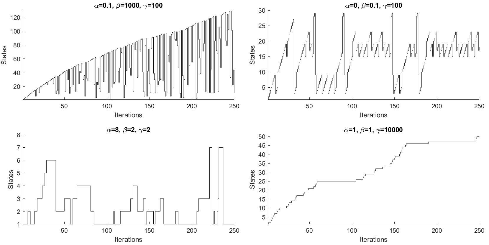

# ihmm
- Beal, The Infinite Hidden Markov Model, 2002

## Hidden State Generation Example
- **alpha:** Influences the number of self-transitions
- **beta:** Explore new transitions
- **gamma:** Expected number of hidden states



```matlab
a = 0.1;
B = 1000;
y = 100;

T = 250;

[s, n, n_oracle] = genhidden(T, a, B, y);
```

Using the same values and legend from Fig. 1 (Beal, 2002).
1. (Top left): "Explores many states with a sparse transition matrix."
2. (Top right): "Retraces multiple interacting trajectory segments."
3. (Bottom left): "Switches between a few different states."
4. (Bottom right): "Strict left-to-right transition dynamics with long linger time."